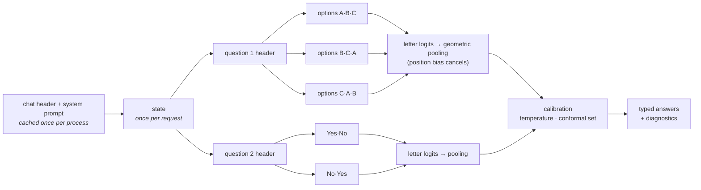

<div align="center">

# LocalDecision

**Typed, calibrated decisions from open-weight LLMs.<br/>One forward pass, zero generated tokens, entirely on your machine.**

[](pyproject.toml)
[](LICENSE)
[](#install)
[](#how-it-works)

</div>

> **New here?** [howToWorkApp.md](howToWorkApp.md) walks you from an empty machine to your first
> decisions, step by step.

Most automation needs a **decision**, not a paragraph: *which queue*, *is this urgent*, *how
severe*. Asking a chat model for that means generating text, hoping it is valid JSON, and
parsing it back into an `if` statement, with no honest measure of how sure the model was.

LocalDecision turns any instruction-tuned open model into a **decision function**. You send a
*state* and typed *questions*; you get typed *answers* with a full probability distribution,
read directly from the model's next-token logits. Nothing is sampled, so an answer can never be
malformed, and every answer comes with the numbers your code needs to decide whether to act.

```python
import localdecision as ld

engine = ld.load()  # Qwen3-1.7B on MLX (Apple Silicon) or PyTorch (CUDA / MPS / CPU)

result = engine.system_one(
    "Help! My payouts have been failing for 3 days and our suppliers are waiting.",
    {
        "urgent": ld.Noul("Does this convey urgency?"),
        "team": ld.Choice("Which team should handle this?", {
            "billing": "Payments, payouts, refunds",
            "technical": "Bugs, outages",
            "sales": None,
        }),
        "anger": ld.Score("How frustrated is the customer?", ["Calm", "Frustrated", "Very angry"]),
    },
)

result.answers["team"].choice          # 'billing'
result.answers["team"].probabilities   # {'billing': 0.99.., 'technical': 0.00.., 'sales': 0.0..}
result.answers["urgent"].noul          # 0.99..  (probability of "yes")
result.answers["anger"].score          # 1.0.. (expected level, can land between levels)
result.diagnostics["team"].agreement   # 1.0   (all option orderings agree)
```

## Highlights

- **Three typed primitives.** `noul` (yes/no → P(yes)), `choice` (2–255 options → argmax +
  distribution + confidence), `score` (ordered rubric → expected level + distribution).
- **Zero generation.** One forward pass per view; only the answer letters' logits are read.
  Output is typed by construction: no JSON repair, no refusals, no hallucinated labels.
- **Prefix tree execution.** The system prompt is cached once per process, the state once per
  request, each question header once per question; option views run as right-padded batches on
  replicated KV caches. Questions stay independent: adding one never changes another's answer.
- **Position-debiased views.** Options are shown in cyclic orders and pooled by geometric mean,
  which cancels a multiplicative position preference *exactly*. View disagreement is exposed as
  a label-free instability signal.
- **Up to 255 options.** Large choices run as a tournament whose rounds are merged with Luce's
  choice axiom, reproducing the single-shot distribution exactly for a consistent model.
- **Calibration, measured.** Per-primitive temperature scaling plus split-conformal
  prediction sets with a finite-sample coverage guarantee. On five public benchmarks the
  calibration error falls 2 to 9 times and the sets meet their 90% coverage target on average
  ([results](#calibrated-probabilities)); a one-element set is a natural "act automatically" rule.
- **Drop-in HTTP API.** `POST /v1/systemone` speaks the same wire format as TypeSafe's hosted
  System One API; the official `typesafe-sdk` works against a local server by changing only its
  base URL (verified with `typesafe-sdk` 0.7.0).
- **Two backends, verified at load.** MLX for Apple Silicon, PyTorch for CUDA/MPS/CPU. A
  self-test checks the fast path against a plain forward pass and falls back automatically.
- **Evaluation built in.** Accuracy, NLL, Brier, ECE, risk–coverage, conformal coverage and set
  size, latency; adapters for public datasets; a hand-written smoke set; every published number
  can be recomputed offline from the saved per-decision records.

## How it works



1. **Every question becomes a multiple-choice prompt** whose answer is one letter token. The
   tokenizer is checked at load time: each letter must be a single token in that position, and
   prefix + suffix tokenization must be exactly additive, so cached prefixes are bit-for-bit the
   tokens a full prompt would produce.
2. **The prompt is executed as a tree.** Shared nodes are computed once; leaves (option views)
   are batched against replicated KV caches.
3. **Only the answer letters are read.** The final hidden state of each view goes through the
   LM head; a softmax over the letters on screen gives that view's distribution.
4. **Views are pooled, tournaments merged, calibration applied**, and the result is rendered as
   a typed answer with diagnostics (`agreement`, `margin`, `entropy_confidence`, `format_mass`,
   `prediction_set`) and timings.

The math, the proofs of exactness and the references are in [docs/ALGORITHM.md](docs/ALGORITHM.md).

## Install

Requires Python ≥ 3.11 and [uv](https://docs.astral.sh/uv/) (or pip).

```bash
git clone https://github.com/iamvinbas/localdecision
cd localdecision

# Apple Silicon (Metal)
uv sync --extra mlx --extra server

# NVIDIA GPU, Apple MPS or CPU
uv sync --extra torch --extra server
```

The first run downloads the default model from Hugging Face: `mlx-community/Qwen3-1.7B-8bit`
(~1.8 GB) on MLX, `Qwen/Qwen3-1.7B` (~4 GB) on PyTorch. It fits an ordinary laptop with 8 GB of
RAM. Any instruction-tuned causal LM with a chat template works: pass `--model <repo or path>`;
`mlx-community/Qwen3-0.6B-8bit` (~0.6 GB) is faster, `mlx-community/Qwen3-4B-8bit` (~4.3 GB) more
accurate ([model size](#model-size) compares the three). A decision-tuned 1.7B model is the
next step on the [roadmap](#roadmap); its training set builder is ready in [training/](training/README.md).

```bash
uv run localdecision selftest          # loads the model and prints the self-test result
```

## Usage

### Python

```python
import localdecision as ld

engine = ld.load("mlx-community/Qwen3-1.7B-8bit", calibration="calibration.json")
r = engine.system_one(state, questions, debias="auto")   # settings are optional
```

`state` can be a string, a JSON object or an array. `instructions` and option descriptions can
also be structured JSON (e.g. `{"policy": "...", "question": "Is this eligible under `policy`?"}`).

### HTTP

```bash
uv run localdecision serve --port 8080            # LOCALDECISION_API_KEY=... enables Bearer auth

curl -s localhost:8080/v1/systemone -H 'Content-Type: application/json' -d @examples/ticket.json
```

| Endpoint | Purpose |
| --- | --- |
| `POST /v1/systemone` | state + questions → answers (+ `diagnostics`, `timing`) |
| `GET /v1/models` | served model and the `localdecision-latest` alias |
| `GET /health` | backend, device, self-test, calibration |
| `GET /docs` | interactive OpenAPI documentation |

Request and answer shapes:

```jsonc
// request
{
  "state": "text | object | array",
  "model": "localdecision-latest",               // any name is accepted; the response reports the real one
  "questions": {
    "is_urgent":  {"type": "noul",   "instructions": "Does this convey urgency?",
                   "criteria": {"true": "Time-sensitive", "false": "Routine"}},   // optional
    "department": {"type": "choice", "instructions": "Which team?",
                   "criteria": {"billing": "Payments", "technical": "Bugs", "sales": null}},
    "frustration":{"type": "score",  "instructions": "How frustrated?",
                   "criteria": ["Calm", "Frustrated", "Very angry"]}             // low -> high
  },
  "settings": {"debias": "auto", "calibrated": true, "diagnostics": true}        // optional extension
}

// response for examples/ticket.json (Qwen3-1.7B 8-bit, raw probabilities, MacBook Pro M3 Pro)
{
  "model": "Qwen3-1.7B-8bit",
  "answers": {
    "is_urgent":   {"type": "noul", "noul": 1.0},
    "department":  {"type": "choice", "choice": "billing",
                    "probabilities": {"billing": 0.999952, "technical": 4.8e-05, "account": 0.0, "sales": 0.0},
                    "confidence": 0.999936},
    "frustration": {"type": "score", "score": 1.0,
                    "legend": {"0": "Calm, just stating facts", "1": "Frustrated but civil", "2": "Very angry, threatening to leave"},
                    "probabilities": {"0": 0.0, "1": 0.999999, "2": 1e-06}, "confidence": 0.999998}
  },
  "usage": {"input_tokens": 595, "output_tokens": 0},
  "diagnostics": {                                  // one entry per question; one shown
    "department": {"views": 4, "agreement": 0.75, "margin": 0.999903, "entropy_confidence": 0.999619,
                   "format_mass": 0.980255, "temperature": 1.0, "stages": 1}
  },
  "timing": {"total_ms": 580.67, "prefill_ms": 134.86, "readout_ms": 394.37, "cached_tokens": 48,
             "prefix_tokens": 101, "suffix_tokens": 446, "probes": 8, "batches": 3}
}
```

`settings.debias`: `none` (1 view), `swap` (original + reversed), `cyclic` (every cyclic shift,
capped by `max_views`), `auto` (cyclic for ≤ 4 options, swap otherwise). Invalid requests (fewer
than 2 options, more than 255 options or 10 levels, empty state, over the context limit) return
`422` with the reason; nothing is ever truncated silently.

**Existing System One clients** work unchanged:

```bash
TYPESAFE_BASE_URL=http://127.0.0.1:8080 TYPESAFE_API_KEY=local python your_app.py
```

### Command line

| Command | What it does |
| --- | --- |
| `localdecision serve` | run the HTTP API |
| `localdecision ask request.json` | answer one request from a file (or `-` for stdin) |
| `localdecision eval data.jsonl --debias none,auto` | score a labelled dataset, compare modes |
| `localdecision fetch boolq -o data/boolq.jsonl` | export a public benchmark (`boolq`, `sst5`, `agnews`, `arc`, `banking77`) |
| `localdecision calibrate records.jsonl -o calibration.json` | fit temperature + conformal thresholds |
| `localdecision report records.jsonl --calibration calibration.json` | re-score saved records offline |
| `localdecision selftest` | load a model and check the shared-prefix path |

Common flags: `--backend auto|mlx|torch`, `--model`, `--batch-size`, `--max-context`,
`--kv-budget-gb`, `--bits 4|8` (MLX), `--device`, `--dtype` (PyTorch), `--calibration`.

## Results

Measured on a **MacBook Pro M3 Pro (18 GB)** with MLX 0.32, prompt `ld-prompt-v1`, **zero-shot**:
no training and no examples in the prompt. Each public dataset is shuffled with a fixed seed and
cut into two disjoint windows of 200 rows: the **test** window produces every number below, the
**calibration** window is used only to fit the calibration profiles
([protocol](benchmarks/README.md)). The per-decision records, with the raw log-probabilities, are
in [`results/`](results), so every table can be recomputed offline, without a model:
`python benchmarks/make_tables.py results/public-Qwen3-1.7B-8bit`. Latency is wall-clock per
decision, warm model.

### Accuracy and speed

Default model, `mlx-community/Qwen3-1.7B-8bit`:

| Set | Primitive | n | Accuracy, 1 view | Accuracy, debiased | Views disagree | Accuracy, views agree / disagree | ms / decision, 1 view | ms / decision, debiased |
| --- | --- | ---: | ---: | ---: | ---: | ---: | ---: | ---: |
| Smoke set ([hand-written](benchmarks/README.md)) | mixed | 83 | 0.843 | 0.855 | 0.20 | 0.91 / 0.65 | 90 | 176 |
| BoolQ | noul | 200 | 0.725 | 0.755 | 0.18 | 0.80 / 0.56 | 163 | 212 |
| SST-5 | score (5) | 200 | 0.330 | 0.350 | 0.47 | 0.28 / 0.43 | 114 | 190 |
| AG News | choice (4) | 200 | 0.875 | 0.875 | 0.12 | 0.91 / 0.62 | 134 | 309 |
| ARC-Challenge | choice (3–5) | 200 | 0.765 | 0.780 | 0.38 | 0.87 / 0.63 | 111 | 293 |
| Banking77 | choice (77) | 200 | 0.540 | 0.620 | 0.47 | 0.79 / 0.42 | 644 | 1231 |

- **Fast enough for real-time use**: 0.1–0.3 s per decision on a laptop. Banking77, whose 77
  options run as a tournament, takes 0.6 s with one view.
- **Debiased views** add up to 8 points (Banking77) at roughly twice the cost.
- **View disagreement is a free warning sign.** Without any label, the decisions on which the
  views disagree are far less accurate: 0.42 against 0.79 on Banking77, 0.62 against 0.91 on
  AG News. SST-5, where the model is weak either way, is the exception.
- **Fine-grained scales are hard** for a small model (SST-5, five sentiment levels); the 4B
  model does much better ([model size](#model-size)).

### Calibrated probabilities

Raw probabilities are badly over-confident: the model says ~100% even when it is wrong, and the
fitted temperatures (the logits have to be divided by 5 to 15) measure by how much. Each
dataset's profile is fitted on its own calibration window and applied to its test window, as you
would calibrate on decisions from your own domain. Conformal sets use `alpha = 0.1`, a 90%
coverage target.

| Set | Temperature | NLL raw → calibrated | ECE raw → calibrated | Set coverage | Mean set size | Singleton sets (automated) | Accuracy when automated |
| --- | ---: | ---: | ---: | ---: | ---: | ---: | ---: |
| BoolQ | 14.6 | 4.26 → 0.50 | 0.246 → 0.075 | 0.875 | 1.2 | 75% | 0.833 (125/150) |
| SST-5 | 9.9 | 5.44 → 1.47 | 0.565 → 0.065 | 0.875 | 3.3 | 3% | 0.167 (1/6) |
| AG News | 7.8 | 2.52 → 0.44 | 0.124 → 0.054 | 0.905 | 1.1 | 92% | 0.907 (166/183) |
| ARC-Challenge | 6.8 | 2.54 → 0.65 | 0.186 → 0.083 | 0.900 | 1.5 | 68% | 0.874 (118/135) |
| Banking77 | 5.1 | 7.31 → 1.89 | 0.336 → 0.048 | 0.925 | 22.8 | 2% | 1.000 (3/3) |

- **Calibration error falls 2 to 9 times** (ECE), and the log-loss (NLL) 4 to 9 times.
  Accuracy does not move: calibration never changes which answer is chosen.
- **The sets keep their promise on average.** Over the 15 model × dataset pairs
  measured (this table and [model size](#model-size)), the sets contain the right answer 0.899 of
  the time against a 0.90 target. Single pairs range from 0.845 to 0.945, the scatter expected
  when each threshold is fitted on 100 examples.
- **How much can run unattended depends on the task, and the sets show it.** 92% of AG News
  decisions get a one-element set, and 91% of those are right. On Banking77 almost none do, but
  the set narrows 77 intents down to about 23 for a person, or a bigger model, to finish.
- **The guarantee is an average over all decisions.** On BoolQ and ARC the automated decisions
  are right 83–87% of the time, a little under 90%: the decisions with larger sets make up the
  difference. If the automated ones must meet a bar, measure them on a test set and lower
  `alpha`.

### Model size

Same protocol, three sizes of Qwen3 with 8-bit weights on MLX. Each cell is the accuracy with
debiased views · milliseconds per decision.

| Set | Qwen3-0.6B (0.6 GB) | Qwen3-1.7B (1.8 GB, default) | Qwen3-4B (4.3 GB) |
| --- | ---: | ---: | ---: |
| BoolQ | 0.730 · 80 ms | 0.755 · 212 ms | 0.835 · 481 ms |
| SST-5 | 0.200 · 75 ms | 0.350 · 190 ms | 0.535 · 468 ms |
| AG News | 0.760 · 114 ms | 0.875 · 309 ms | 0.870 · 771 ms |
| ARC-Challenge | 0.595 · 90 ms | 0.780 · 293 ms | 0.885 · 604 ms |
| Banking77 | 0.385 · 434 ms | 0.620 · 1231 ms | 0.610 · n/a¹ |
| ECE after calibration, mean of the sets | 0.065 | 0.065 | 0.076 |
| Automated (singleton sets), all sets pooled | 29% · 0.860 right | 48% · 0.866 right | 58% · 0.887 right |

<sub>¹ This run was paused at regular intervals to keep the laptop's GPU below full load, so its
latency is not comparable and is left out ([note](results/public-Qwen3-4B-8bit/banking77-test/NOTE.md));
accuracy and calibration are unaffected.</sub>

- **4B is the accurate choice**: 8 to 18.5 points more than 1.7B on BoolQ, ARC and SST-5, at 2
  to 2.5 times the latency. It gains nothing on AG News, already easy, or on Banking77.
- **0.6B is 2.5 to 3.3 times faster** than 1.7B but loses most where the task is hardest: 18.5
  points on ARC, 23.5 on Banking77, and on SST-5 it is at chance (0.200 with five levels).
- **Calibration works at every size** (mean ECE 0.065–0.076 after calibration), and a better
  model is not only more accurate: it is sure more often, so more decisions can be automated
  (58% against 48% and 29%) at a similar 86–89% accuracy.
- **1.7B stays the default**: it fits an 8 GB laptop and answers in 0.1–0.3 s. Pass
  `--model mlx-community/Qwen3-4B-8bit` when accuracy matters more than latency and memory.

Decision-tuning a small model, so that it is calibrated and position-invariant without a
profile, is the next step on the [roadmap](#roadmap).

## Calibrating on your own data

Raw probabilities from instruction-tuned models are sharply over-confident. Before you put
thresholds on them, fit a profile on labelled decisions from your domain:

```bash
# 1. label a few hundred real decisions in the eval JSONL format (see benchmarks/README.md)
localdecision eval my-calibration.jsonl --debias auto --output runs/cal
# 2. fit temperature + conformal thresholds (alpha = tolerated miss rate of the sets)
localdecision calibrate runs/cal/records-auto.jsonl -o calibration.json --alpha 0.05
# 3. check on a separate labelled set, then serve with the profile
localdecision eval my-test.jsonl --calibration calibration.json
localdecision serve --calibration calibration.json
```

With a profile loaded, every answer carries `diagnostics.prediction_set`. A reasonable policy:
act automatically when the set has one element, ask a human (or a bigger model) otherwise, and
choose `alpha` from the cost of a wrong automatic action. The profile stores a fingerprint of
the model, backend and prompt version; a mismatch is reported at start-up.

## Design notes

- **Keep code in control.** Ask narrow, atomic questions and combine them in code
  ([examples/support_router.py](examples/support_router.py)); change a weight in Python rather
  than a prompt.
- **Numbers belong in code.** Small models compare numbers and dates unreliably (3 of 5 right
  on the smoke set's `numeric` tag). Compute them and ask the model the semantic part.
- **One resident model.** Requests are serialized on one inference thread; parallelism lives
  inside a request, where it is free.

## Limitations

- Quality is bounded by the model. A 1.7B model is fast and fine for common-sense judgments,
  weaker at fine-grained scales, arithmetic, dates and multi-hop reasoning.
- Uncalibrated probabilities are over-confident; `confidence` is a property of the
  distribution's shape, not a probability of being right, until you calibrate.
- Conformal coverage holds on average over all decisions, not for each one, and not for the
  automated (one-element) subset alone. Measure that subset on your own test set.
- Calibration fixes what the numbers mean, not how often the model is right: where a model is
  at chance (Qwen3-0.6B on SST-5), calibration makes its answers honestly uncertain, not better.
- Cyclic views remove *positional* bias, not bias towards particular option *content*.
- English prompts work best; other languages work but are less accurate.
- Localhost by default; no rate limiting. Put it behind your own gateway before exposing it.

## Roadmap

- **Decision-tuned small model.** Fine-tune a 1–2B model (LoRA) on the LocalDecision prompt,
  with a loss on the answer letters only (cross-entropy + Brier) and options shuffled at every
  step, so it is calibrated and position-invariant by design. The training set is ready:
  `training/build_dataset.py` builds 116k decisions from permissively licensed sources, with
  AG News, SST-5, Banking77 and the smoke set kept out for testing. Training fits a free cloud
  GPU (Kaggle / Colab); the trainer is not written yet.
- Cross-request prefix cache (radix tree) for repeated states, e.g. game loops and agents.
- Multi-token option labels to lift the 26-letters-per-view limit without a tournament.
- Contextual (content-free) prior correction as an optional second debiasing step.
- vLLM / llama.cpp backends; streaming of answers as each question completes.
- A small playground page served by `localdecision serve`.

## Project layout

```
src/localdecision/
  schema.py          wire format (pydantic): questions, answers, settings, diagnostics
  prompts.py         prompt layout, tokenizer checks (single-token letters, additive split)
  engine.py          planning, prefix tree execution, tournaments, answers
  readout.py         pure math: pooling, Luce chaining, confidence statistics
  calibration.py     temperature scaling, split-conformal thresholds
  metrics.py         accuracy, NLL, Brier, ECE, risk-coverage
  evaluation.py      eval harness and reports
  public_data.py     public benchmark adapters
  server.py, cli.py  FastAPI server and command line
  backends/          mlx_backend.py, torch_backend.py, mock.py (deterministic, for tests)
docs/ALGORITHM.md    the method in detail, with references
benchmarks/          smoke set, public benchmark runner, prefix-reuse benchmark
examples/            request JSON, confidence-gated router, stdlib HTTP client
tests/               unit tests (no weights needed) + optional real-model tests
```

## Development

```bash
uv sync --extra mlx --extra server --extra dev
uv run pytest -q                        # unit tests, no model weights needed
LOCALDECISION_TEST_MODEL=mlx-community/Qwen3-1.7B-8bit uv run pytest tests/test_model.py
uv run ruff check src tests && uv run ruff format --check src tests
```

## License

[MIT](LICENSE) © 2026 Vincenzo Basile. Model weights are downloaded from their publishers and
keep their own licenses (Qwen3: Apache-2.0).

<sub>TypeSafe and Jev are trademarks of their respective owners. LocalDecision is an independent
project, not affiliated with or endorsed by them; the `/v1/systemone` compatibility refers only to
the public HTTP request/response format.</sub>
