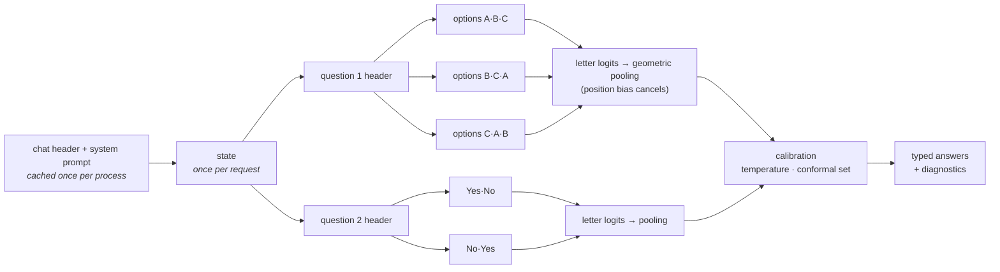

<div align="center">

# LocalDecision

**Typed, calibrated decisions from open-weight LLMs.<br/>One forward pass, zero generated tokens, entirely on your machine.**

[](pyproject.toml)
[](LICENSE)
[](#install)
[](#how-it-works)

</div>

> **New here?** [howToWorkApp.md](howToWorkApp.md) walks you from an empty machine to your first
> decisions, step by step.

Most automation needs a **decision**, not a paragraph: *which queue*, *is this urgent*, *how
severe*. Asking a chat model for that means generating text, hoping it is valid JSON, and
parsing it back into an `if` statement, with no honest measure of how sure the model was.

LocalDecision turns any instruction-tuned open model into a **decision function**. You send a
*state* and typed *questions*; you get typed *answers* with a full probability distribution,
read directly from the model's next-token logits. Nothing is sampled, so an answer can never be
malformed, and every answer comes with the numbers your code needs to decide whether to act.

```python
import localdecision as ld

engine = ld.load()  # Qwen3-4B-Instruct on MLX (Apple Silicon) or PyTorch (CUDA / MPS / CPU)

result = engine.system_one(
    "Help! My payouts have been failing for 3 days and our suppliers are waiting.",
    {
        "urgent": ld.Noul("Does this convey urgency?"),
        "team": ld.Choice("Which team should handle this?", {
            "billing": "Payments, payouts, refunds",
            "technical": "Bugs, outages",
            "sales": None,
        }),
        "anger": ld.Score("How frustrated is the customer?", ["Calm", "Frustrated", "Very angry"]),
    },
)

result.answers["team"].choice          # 'billing'
result.answers["team"].probabilities   # {'billing': 0.99.., 'technical': 0.00.., 'sales': 0.0..}
result.answers["urgent"].noul          # 0.99..  (probability of "yes")
result.answers["anger"].score          # 1.0.. (expected level, can land between levels)
result.diagnostics["team"].agreement   # 1.0   (all option orderings agree)
```

## Highlights

- **Three typed primitives.** `noul` (yes/no → P(yes)), `choice` (2–255 options → argmax +
  distribution + confidence), `score` (ordered rubric → expected level + distribution).
- **Zero generation.** One forward pass per view; only the answer letters' logits are read.
  Output is typed by construction: no JSON repair, no refusals, no hallucinated labels.
- **Prefix tree execution.** The system prompt is cached once per process, the state once per
  request, each question header once per question; option views run as right-padded batches on
  replicated KV caches. Questions stay independent: adding one never changes another's answer.
- **Position-debiased views.** Options are shown in cyclic orders and pooled by geometric mean,
  which cancels a multiplicative position preference *exactly*. View disagreement is exposed as
  a label-free instability signal.
- **Up to 255 options.** Large choices run as a tournament whose rounds are merged with Luce's
  choice axiom, reproducing the single-shot distribution exactly for a consistent model.
- **Calibration you can trust.** Per-primitive temperature scaling plus split-conformal
  prediction sets with a finite-sample coverage guarantee: a singleton set is a principled
  "act automatically" rule.
- **Drop-in HTTP API.** `POST /v1/systemone` speaks the same wire format as TypeSafe's hosted
  System One API; the official `typesafe-sdk` works against a local server by changing only its
  base URL (verified with `typesafe-sdk` 0.7.0).
- **Two backends, verified at load.** MLX for Apple Silicon, PyTorch for CUDA/MPS/CPU. A
  self-test checks the fast path against a plain forward pass and falls back automatically.
- **Evaluation built in.** Accuracy, NLL, Brier, ECE, risk–coverage, conformal coverage, latency;
  adapters for public datasets; a hand-written smoke set.

## How it works



1. **Every question becomes a multiple-choice prompt** whose answer is one letter token. The
   tokenizer is checked at load time: each letter must be a single token in that position, and
   prefix + suffix tokenization must be exactly additive, so cached prefixes are bit-for-bit the
   tokens a full prompt would produce.
2. **The prompt is executed as a tree.** Shared nodes are computed once; leaves (option views)
   are batched against replicated KV caches.
3. **Only the answer letters are read.** The final hidden state of each view goes through the
   LM head; a softmax over the letters on screen gives that view's distribution.
4. **Views are pooled, tournaments merged, calibration applied**, and the result is rendered as
   a typed answer with diagnostics (`agreement`, `margin`, `entropy_confidence`, `format_mass`,
   `prediction_set`) and timings.

The math, the proofs of exactness and the references are in [docs/ALGORITHM.md](docs/ALGORITHM.md).

## Install

Requires Python ≥ 3.11 and [uv](https://docs.astral.sh/uv/) (or pip).

```bash
git clone https://github.com/iamvinbas/localdecision
cd localdecision

# Apple Silicon (Metal)
uv sync --extra mlx --extra server

# NVIDIA GPU, Apple MPS or CPU
uv sync --extra torch --extra server
```

The first run downloads the default model from Hugging Face:
`mlx-community/Qwen3-4B-Instruct-2507-8bit` (~4.3 GB) on MLX, `Qwen/Qwen3-4B-Instruct-2507`
(~8 GB) on PyTorch. Any instruction-tuned causal LM with a chat template works: pass
`--model <repo or path>`. `mlx-community/Qwen3-0.6B-8bit` (~0.6 GB) is a quick way to try things.

```bash
uv run localdecision selftest          # loads the model and prints the self-test result
```

## Usage

### Python

```python
import localdecision as ld

engine = ld.load("mlx-community/Qwen3-4B-Instruct-2507-8bit", calibration="calibration.json")
r = engine.system_one(state, questions, debias="auto")   # settings are optional
```

`state` can be a string, a JSON object or an array. `instructions` and option descriptions can
also be structured JSON (e.g. `{"policy": "...", "question": "Is this eligible under `policy`?"}`).

### HTTP

```bash
uv run localdecision serve --port 8080            # LOCALDECISION_API_KEY=... enables Bearer auth

curl -s localhost:8080/v1/systemone -H 'Content-Type: application/json' -d @examples/ticket.json
```

| Endpoint | Purpose |
| --- | --- |
| `POST /v1/systemone` | state + questions → answers (+ `diagnostics`, `timing`) |
| `GET /v1/models` | served model and the `localdecision-latest` alias |
| `GET /health` | backend, device, self-test, calibration |
| `GET /docs` | interactive OpenAPI documentation |

Request and answer shapes:

```jsonc
// request
{
  "state": "text | object | array",
  "model": "localdecision-latest",               // any name is accepted; the response reports the real one
  "questions": {
    "is_urgent":  {"type": "noul",   "instructions": "Does this convey urgency?",
                   "criteria": {"true": "Time-sensitive", "false": "Routine"}},   // optional
    "department": {"type": "choice", "instructions": "Which team?",
                   "criteria": {"billing": "Payments", "technical": "Bugs", "sales": null}},
    "frustration":{"type": "score",  "instructions": "How frustrated?",
                   "criteria": ["Calm", "Frustrated", "Very angry"]}             // low -> high
  },
  "settings": {"debias": "auto", "calibrated": true, "diagnostics": true}        // optional extension
}

// response for examples/ticket.json (Qwen3-4B 8-bit, calibration profile from results/, M3 Pro)
{
  "model": "Qwen3-4B-Instruct-2507-8bit",
  "answers": {
    "is_urgent":   {"type": "noul", "noul": 0.917187},
    "department":  {"type": "choice", "choice": "billing",
                    "probabilities": {"billing": 0.914976, "technical": 0.045383, "account": 0.020248, "sales": 0.019393},
                    "confidence": 0.886634},
    "frustration": {"type": "score", "score": 1.309239,
                    "legend": {"0": "Calm, just stating facts", "1": "Frustrated but civil", "2": "Very angry, threatening to leave"},
                    "probabilities": {"0": 0.127174, "1": 0.436413, "2": 0.436413}, "confidence": 0.15462}
  },
  "usage": {"input_tokens": 563, "output_tokens": 0},
  "diagnostics": {                                  // one entry per question; one shown
    "department": {"views": 4, "agreement": 1.0, "margin": 0.869593, "entropy_confidence": 0.727994,
                   "format_mass": 1.0, "temperature": 7.2409, "stages": 1, "prediction_set": ["billing"]}
  },
  "timing": {"total_ms": 1395.61, "prefill_ms": 353.04, "readout_ms": 909.93, "cached_tokens": 48,
             "prefix_tokens": 101, "suffix_tokens": 414, "probes": 8, "batches": 3}
}
```

`settings.debias`: `none` (1 view), `swap` (original + reversed), `cyclic` (every cyclic shift,
capped by `max_views`), `auto` (cyclic for ≤ 4 options, swap otherwise). Invalid requests (fewer
than 2 options, more than 255 options or 10 levels, empty state, over the context limit) return
`422` with the reason; nothing is ever truncated silently.

**Existing System One clients** work unchanged:

```bash
TYPESAFE_BASE_URL=http://127.0.0.1:8080 TYPESAFE_API_KEY=local python your_app.py
```

### Command line

| Command | What it does |
| --- | --- |
| `localdecision serve` | run the HTTP API |
| `localdecision ask request.json` | answer one request from a file (or `-` for stdin) |
| `localdecision eval data.jsonl --debias none,auto` | score a labelled dataset, compare modes |
| `localdecision fetch boolq -o data/boolq.jsonl` | export a public benchmark (`boolq`, `sst5`, `agnews`, `arc`, `banking77`) |
| `localdecision calibrate records.jsonl -o calibration.json` | fit temperature + conformal thresholds |
| `localdecision report records.jsonl --calibration calibration.json` | re-score saved records offline |
| `localdecision selftest` | load a model and check the shared-prefix path |

Common flags: `--backend auto|mlx|torch`, `--model`, `--batch-size`, `--max-context`,
`--kv-budget-gb`, `--bits 4|8` (MLX), `--device`, `--dtype` (PyTorch), `--calibration`.

## Results

All numbers below were measured on a **MacBook Pro M3 Pro (18 GB)** with the default model
`mlx-community/Qwen3-4B-Instruct-2507-8bit` on MLX 0.32, prompt `ld-prompt-v1`. Every run writes
per-decision records (with raw pooled log-probabilities) to [`results/`](results), so any number
can be recomputed with `localdecision report`. Latency is wall-clock per decision, warm model,
one request at a time.

### Hand-written smoke set

83 decisions over 44 states ([benchmarks/README.md](benchmarks/README.md)); small and labelled
by the author, so read it as a sanity check, not a benchmark.

| Views | All | Choice (35) | Noul (33) | Score (15) | ms / decision |
| --- | ---: | ---: | ---: | ---: | ---: |
| 1 view | 0.940 | 1.000 | 0.939 | 0.800 | 215 |
| debiased (`auto`) | 0.940 | 1.000 | 0.939 | 0.800 | 443 |

The 5 errors: three borderline labels (is a polite message about a double charge "calm" or
"frustrated"? is "fix it before we pay at the end of the month" urgent?), one numeric comparison
(`disk_percent: 88` judged "above 90") and one ordinal CV fit. All five were made with a raw
probability of ~1.0, which is what calibration is for.

### Public datasets

200 test decisions per dataset, sampled with a fixed seed; calibration fitted on a **disjoint**
window of 200 decisions per dataset ([protocol](benchmarks/README.md#public-datasets)).

| Dataset | Primitive | Accuracy, 1 view | Accuracy, debiased | Views disagree | ms / decision, 1 view | ms / decision, debiased |
| --- | --- | ---: | ---: | ---: | ---: | ---: |
| BoolQ | noul | 0.855 | 0.865 | 3.0% | 404 | 499 |
| AG News | choice (4) | 0.885 | 0.910 | 10.0% | 350 | 737 |
| ARC-Challenge | choice (3–5) | 0.885 | 0.905 | 13.0% | 265 | 579 |
| SST-5 | score (5 levels) | 0.420 | 0.385 | 15.0% | 278 | 476 |

Calibration (temperature + conformal sets at α = 0.1, fitted on the other window) applied to the
debiased runs:

| Dataset | NLL raw → calibrated | ECE raw → calibrated | Brier raw → calibrated | Set coverage (target 0.90) | Singleton sets |
| --- | ---: | ---: | ---: | ---: | ---: |
| BoolQ | 2.733 → 0.335 | 0.132 → 0.066 | 0.255 → 0.201 | 0.920 | 84.5% |
| AG News | 1.894 → 0.346 | 0.087 → 0.030 | 0.169 → 0.155 | 0.910 | 100% |
| ARC-Challenge | 1.179 → 0.292 | 0.086 → 0.060 | 0.173 → 0.136 | 0.905 | 100% |
| SST-5 | 10.16 → 1.315 | 0.573 → 0.104 | 1.141 → 0.692 | 0.815 | 8.5% |

Fitted temperatures: choice 7.2, noul 12.0, score 14.8.

What the numbers say:

- **Debiased views help choices and yes/no questions** (+1.0 to +2.5 points on BoolQ, AG News,
  ARC, with lower NLL) **and hurt the 5-level ordinal scale** (−3.5 points on SST-5, where each
  view alone scores 0.42 / 0.41 but the pooled answer 0.385). None of these differences is
  significant on its own at n = 200 (paired McNemar p = 0.12–0.5); the direction is consistent.
  They roughly double latency, so `settings.debias` is exposed per request.
- **Raw probabilities are badly over-confident** (optimal temperatures of 7–15). Calibration cuts
  NLL by 3–8× and ECE by half or more without changing a single answer.
- **Conformal sets hit their target** on BoolQ, AG News and ARC (0.905–0.92 coverage for 0.90).
  On SST-5 coverage fell short (0.815): its threshold was fitted on only 100 points of the
  calibration window, which is noisy. Use a few hundred labelled decisions per question type.
- **SST-5 is hard** for a 4B model at 5 fine-grained levels (0.42 exact, 0.86 within one level,
  mean absolute error 0.73 levels).
- Not run yet: Banking77 (77-way tournament), and the ~1B lightweight model.

## Calibrating on your own data

Raw probabilities from instruction-tuned models are sharply over-confident. Before you put
thresholds on them, fit a profile on labelled decisions from your domain:

```bash
# 1. label a few hundred real decisions in the eval JSONL format (see benchmarks/README.md)
localdecision eval my-calibration.jsonl --debias auto --output runs/cal
# 2. fit temperature + conformal thresholds (alpha = tolerated miss rate of the sets)
localdecision calibrate runs/cal/records-auto.jsonl -o calibration.json --alpha 0.05
# 3. check on a separate labelled set, then serve with the profile
localdecision eval my-test.jsonl --calibration calibration.json
localdecision serve --calibration calibration.json
```

With a profile loaded, every answer carries `diagnostics.prediction_set`. A reasonable policy:
act automatically when the set has one element, ask a human (or a bigger model) otherwise, and
choose `alpha` from the cost of a wrong automatic action. The profile stores a fingerprint of
the model, backend and prompt version; a mismatch is reported at start-up.

## Design notes

- **Keep code in control.** Ask narrow, atomic questions and combine them in code
  ([examples/support_router.py](examples/support_router.py)); change a weight in Python rather
  than a prompt.
- **Numbers belong in code.** Small models compare numbers and dates unreliably (see the
  `numeric` tag above). Compute them and ask the model the semantic part.
- **One resident model.** Requests are serialized on one inference thread; parallelism lives
  inside a request, where it is free.

## Limitations

- No training is involved: quality is the base model's. A 4B model is fast and good at
  common-sense judgments, weaker at arithmetic, dates and multi-hop reasoning.
- Uncalibrated probabilities are over-confident; `confidence` is a property of the
  distribution's shape, not a probability of being right, until you calibrate.
- Cyclic views remove *positional* bias, not bias towards particular option *content*.
- English prompts work best; other languages work but are less accurate.
- Localhost by default; no rate limiting. Put it behind your own gateway before exposing it.

## Roadmap

- Cross-request prefix cache (radix tree) for repeated states, e.g. game loops and agents.
- Multi-token option labels to lift the 26-letters-per-view limit without a tournament.
- Contextual (content-free) prior correction as an optional second debiasing step.
- vLLM / llama.cpp backends; streaming of answers as each question completes.
- A small playground page served by `localdecision serve`.

## Project layout

```
src/localdecision/
  schema.py          wire format (pydantic): questions, answers, settings, diagnostics
  prompts.py         prompt layout, tokenizer checks (single-token letters, additive split)
  engine.py          planning, prefix tree execution, tournaments, answers
  readout.py         pure math: pooling, Luce chaining, confidence statistics
  calibration.py     temperature scaling, split-conformal thresholds
  metrics.py         accuracy, NLL, Brier, ECE, risk-coverage
  evaluation.py      eval harness and reports
  public_data.py     public benchmark adapters
  server.py, cli.py  FastAPI server and command line
  backends/          mlx_backend.py, torch_backend.py, mock.py (deterministic, for tests)
docs/ALGORITHM.md    the method in detail, with references
benchmarks/          smoke set, public benchmark runner, prefix-reuse benchmark
examples/            request JSON, confidence-gated router, stdlib HTTP client
tests/               unit tests (no weights needed) + optional real-model tests
```

## Development

```bash
uv sync --extra mlx --extra server --extra dev
uv run pytest -q                        # unit tests, no model weights needed
LOCALDECISION_TEST_MODEL=mlx-community/Qwen3-0.6B-8bit uv run pytest tests/test_model.py
uv run ruff check src tests && uv run ruff format --check src tests
```

## License

[MIT](LICENSE) © 2026 Vincenzo Basile. Model weights are downloaded from their publishers and
keep their own licenses (Qwen3: Apache-2.0).

<sub>TypeSafe and Jev are trademarks of their respective owners. LocalDecision is an independent
project, not affiliated with or endorsed by them; the `/v1/systemone` compatibility refers only to
the public HTTP request/response format.</sub>
